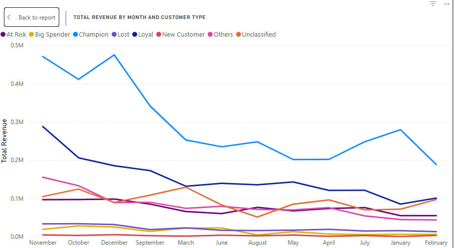

# Customer Segmentation & Revenue Insights — UK Online Retail Dataset

## 🚀 Project Overview
This project analyzes customer purchasing behavior using the UK Online Retail Dataset (Kaggle/UCI). The goal is to help the business identify high-value customer segments, uncover revenue patterns, and drive retention strategies using RFM (Recency, Frequency, Monetary) Analysis.

✅ Tools Used:

- Power BI
- Excel (Power Query, Pivot Tables)

✅ Dataset:

UK Online Retail II Dataset (https://lnkd.in/eH92RFPs)

✅ Powerbi Link:

Go to **PowerBI folder** and download the .pbix file

To view this file, download it and open with the free desktop version of Power BI

## 🎯 Business Objectives
- Segment customers based on purchasing behavior.
- Identify Champions, Loyal, At Risk, and Lost Customers.
- Understand revenue distribution across customer segments.
- Discover peak sales periods and trends.
- Recommend data-driven strategies to increase retention and revenue.

## 🗺️ Dataset Overview
| Column  | Description|
| ------------- | ------------- |
| InvoiceNo	    |Unique transaction ID|
| StockCode	    |Product ID|
| Description	|Product name|
| Quantity	    |Units purchased| 
| InvoiceDate	|Date of transaction |
| UnitPrice	    |Price per unit|
| CustomerID	|Unique customer ID|
| Country	    |Customer country|

## 🔥 Key Analysis Performed
🔧 Data Cleaning:
Removed canceled transactions (InvoiceNo starting with 'C').

Removed missing Customer IDs.

Created TotalPrice = UnitPrice × Quantity.

Extracted invoice month for trend analysis.

#### 🔢 RFM Segmentation:
Recency: Days since last purchase.

Frequency: Total number of purchases.

Monetary: Total revenue generated by each customer.

Assigned RFM scores (1-5) for each metric.

Classified customers into segments: Champions, Loyal, At Risk, Lost, Big Spenders, Others.

#### 📈 Revenue Trends:
Identified peak revenue months (November and December).

Monthly revenue growth trends.

#### 🛍️ Top Products by Customer Segment:
Determined best-selling products for Champions, Loyal, and At Risk customers.

## 📊 Dashboard Features (Power BI)
- Dashboard Overview

- RFM Segment Breakdown

- Revenue Trends Over Time

- Top Products per Segment

- KPI Cards (Total Revenue, Orders, Customers)

## 🏆 Key Insights
Champions: 29.7% → Driving the most revenue.

Loyal Customers: 27.3% → Huge potential for upselling.

At Risk: 13.5% → Require targeted retention strategies.

Big Spenders: Only 0.34% → Critical VIP customers.

Lost: 3.6% → Potential for win-back campaigns.

Peak Sales: November and December → Seasonal sales spikes.

## 🚀 Recommendations
- Reward Champions with VIP perks.

- Upsell to Loyal Customers to convert them into Champions.

- Deploy win-back and retention campaigns for At Risk and Lost customers.

- Prepare marketing campaigns and stock for peak sales months (Nov-Dec).

## 🙌 About Me
I'm Peris Ndanu, a passionate Data Analyst who loves transforming raw data into meaningful business insights.

→ 📫 Connect with me on [([LinkedIn](https://www.linkedin.com/in/peris-ndanu/))] 

→ 💼 Open to Data Analyst and BI Analyst opportunities!

⭐ If You Find This Useful:
→ ⭐ Star the repo | 🍴 Fork it | 🤝 Share feedback

🔗 License:
This project uses public data from Kaggle and is for educational purposes only.
